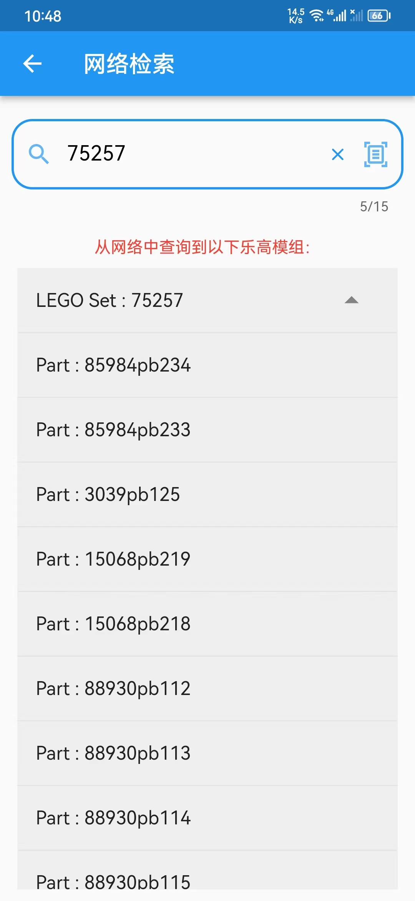
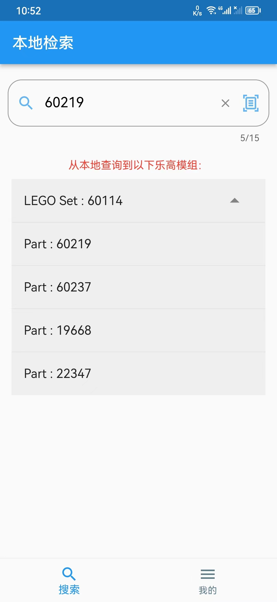

# ocr_project

A new Flutter project.

## Function

- 能从[lego官网](https://www.bricklink.com/catalogList.asp?q=75257&catType=P)查找相应套件中的零件编号，并将零件集合添加到本地

  > 使用了xml标签的解析（DOM对象），类似于python爬虫

- 能显示本地保存的所有套件及其中的零件编号集

- 除了能够从网络搜索套件，也添加了手动添加套件及零件库（需要使用特定的格式输入）

- 检索功能（能从本地查找零件对应的套件编号）

  > 包含手动输入和图片ocr文本识别

